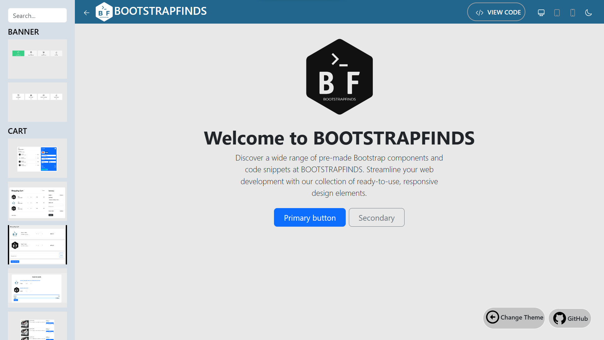
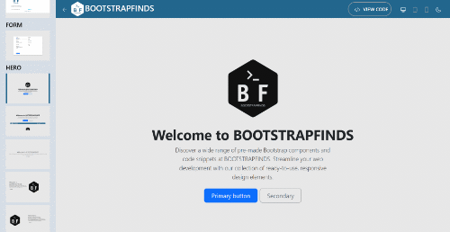

# Bootstrap Blocks - React Project

Bootstrap Blocks is a React project that provides a collection of Bootstrap components and code snippets for easy integration into your web projects.

## Table of Contents
- [Introduction](#introduction)
- [Features](#features)
- [Installation](#installation)
- [Usage](#usage)
- [Screenshots](#screenshots)
- [Contributing](#contributing)
- [License](#license)

## Introduction
This repository contains the source code for Bootstrap Blocks, a React-based project that simplifies the integration of Bootstrap components and code snippets into your web applications.

## Features
- Ready-to-use Bootstrap components
- React-based architecture for easy customization
- Streamlined development with pre-made code snippets
- Responsive design for diverse screen sizes

## Installation
1. Clone the repository: `git clone https://github.com/sangamprashant/bootstrap-blocks.git`
2. Navigate to the project directory: `cd bootstrap-blocks`
3. Install dependencies: `npm install`

## Usage
1. Start the development server: `npm start`
2. Open your browser and visit `http://localhost:3000` to view the project.

## Screenshots

*Include relevant screenshots of the project in action.*

## Contributing
If you would like to contribute to the project, follow these steps:
1. Fork the repository.
2. Create a new branch for your feature: `git checkout -b feature-name`
3. Make your changes and commit them: `git commit -m 'Add new feature'`
4. Push to the branch: `git push origin feature-name`
5. Submit a pull request.

## License
This project is licensed under the [MIT License](LICENSE). Feel free to use and modify the code for your own projects.

---