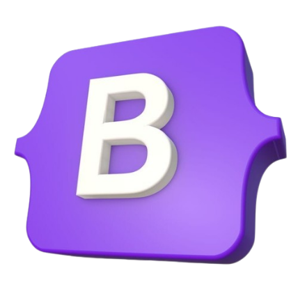

<p align="center">
   
</p>

# Bootstrap Blocks - React Project

[](https://opensource.org/licenses/MIT)

**BootstrapBlocks** is a React project that provides a collection of Bootstrap components and code snippets for easy integration into your web projects.

## Table of Contents

- [Introduction](#introduction)
- [Features](#features)
- [Installation](#installation)
- [Usage](#usage)
- [Screenshots](#screenshots)
- [Reusable Components](#reusable-components)
- [Topics Covered](#topics-covered)
- [Contributing](#contributing)
- [Contributor Guidelines](#contributor-guidelines)
- [License](#license)
- [CDN Used](#cdn-used)

## Introduction

BootstrapBlocks is a React-based project designed to simplify the integration of Bootstrap components and code snippets into your web applications. It offers a range of pre-built components and responsive designs to enhance your development workflow.

## Features

- Ready-to-use Bootstrap components
- React-based architecture for easy customization
- Streamlined development with pre-made code snippets
- Responsive design for diverse screen sizes

## Installation

To get started with BootstrapBlocks, follow these steps:

1. **Clone the repository:**

   ```bash
   git clone https://github.com/sangamprashant/bootstrap-blocks.git
   ```

2. **Navigate to the project directory:**
   ```bash
   cd bootstrap-blocks
   ```
3. **Install dependencies:**
   ```bash
   npm install
   ```

## Usage

To run the project locally:

1. **Start the development server:**
   ```bash
   npm start
   ```
2. **Open your browser and visit** `http://localhost:3000` **to view the project.**

## Screenshots


## Reusable Components

Here are some of the reusable components included in the project:

### PrimaryButton

A customizable primary button that adapts to the current theme.

```js
import React, { useContext } from "react";
import { AppContext } from "../../context/AppContext";

const PrimaryButton = ({ label, c, onClick }) => {
  const { themePrimary, themePrimaryR } = useContext(AppContext);
  return (
    <button
      type="button"
      className={`btn btn-${
        themePrimaryR ? "outline-" : ""
      }${themePrimary} btn-lg px-4 ${c}`}
      onClick={onClick}
    >
      {label}
    </button>
  );
};

export default PrimaryButton;
```

### SecondaryButton

A customizable secondary button with theme support.

```js
import React, { useContext } from "react";
import { AppContext } from "../../context/AppContext";

const SecondaryButton = ({ label, c, onClick }) => {
  const { secondaryPrimary, secondaryPrimaryR } = useContext(AppContext);
  return (
    <button
      type="button"
      className={`btn btn-${
        secondaryPrimaryR ? "outline-" : ""
      }${secondaryPrimary} btn-lg px-4 ${c}`}
      onClick={onClick}
    >
      {label}
    </button>
  );
};

export default SecondaryButton;
```

## Topics Covered

This application covers the following topics:

1. **Bootstrap Integration**:

   - Usage of Bootstrap for responsive and styled components.

2. **Reusable React Components**:

   - Creation and use of reusable React components like `PrimaryButton` and `SecondaryButton`.

3. **React Context API**:

   - Implementation of the Context API for managing theme colors and other global state.

4. **Component Customization**:

   - Customizing components based on the current theme and user preferences.

5. **Component Preview and Templates**:

   - How to add new components to the preview and template sections of the application.

6. **Development Setup**:

   - Instructions for cloning the repository, installing dependencies, and running the development server.

7. **Contribution Guidelines**:

   - Detailed steps for contributing to the project, including adding new components and updating the preview and template functions.

8. **Image Handling**:

   - Guidelines for managing images in the project, including saving them in the `public` folder and referencing them correctly in documentation.

9. **Testing and Quality Assurance**:

   - Suggestions for testing new components and ensuring code quality before submission. Consider using tools like Jest for unit testing and ESLint for linting.

10. **Project Structure**:
    - Overview of the project structure, including directories and key files, to help new developers understand the layout and organization.

## Contributing

We welcome contributions to BootstrapBlocks! To contribute:

1. **Fork the repository.**
2. **Create a new branch for your feature:**
   ```bash
   git checkout -b feature-name
   ```
3. **Make your changes and commit them:**
   ```bash
   git commit -m 'Add new feature'
   ```
4. **Add a new component:**

   - Create a new file for your component in the appropriate directory (`./src/components/tamplate`).
   - Follow the existing component structure and naming conventions.
   - Export the component from your file.

5. **Attach the component to the preview array:**

   - Open `src/components/Preview/index.js`.
   - Import your new component at the top of the file.
   - Add your component to the relevant section of the `getPreview` function.

   ```js
   import NewComponentDayA from "./NewComponent/NewComponentDay/A";
   import NewComponentNightA from "./NewComponent/NewComponentNight/A";

   export default function getPreview({ darkMode = false }) {
     return {
       // other sections...
       NewComponent: {
         NewComponentA: darkMode ? (
           <NewComponentNightA height="100" width="100%" />
         ) : (
           <NewComponentDayA height="100" width="100%" />
         ),
       },
     };
   }
   ```

6. **Update the `getTemplate` function:**

   - Open `src/components/tamplate/index.js`.
   - Import your new component at the top of the file.
   - Add your component to the appropriate section in the `getTemplate` function to ensure it's available for use in templates.

   ```js
   import NewComponentTemplateA from "./NewComponentTemplate/A";
   import NewComponentTemplateB from "./NewComponentTemplate/B";

   export default function getTemplate() {
     return {
       // other sections...
       NewComponent: {
         NewComponentA: <NewComponentTemplateA height="100" width="100%" />,
         NewComponentB: <NewComponentTemplateB height="100" width="100%" />,
       },
     };
   }
   ```

7. **Push to the branch:**
   ```bash
   git push origin feature-name
   ```
8. **Submit a pull request.**

## Contributor Guidelines

To ensure a smooth contribution process:

- **Name and Image:**

  - Contributors are encouraged to use their names in the documentation and contributions.
  - If including images in documentation, save them in the `public` folder of the project.
  - When referencing images in the documentation, use the following format:
    ```html
    
    ```
    Avoid using `./` or `/` in the `src` attribute.

- **Code Quality:**

  - Ensure your code adheres to the project's coding standards and best practices.
  - Include comments and documentation where necessary.

- **Testing:**
  - Write tests for new components and functionality where applicable.
  - Ensure all tests pass before submitting a pull request.

## License

This project is licensed under the [MIT License](LICENSE). You are free to use and modify the code for your own projects.

---

**CDN Used:** [Bootstrap CDN](https://cdn.jsdelivr.net/npm/bootstrap@5.3.2/dist/css/bootstrap.min.css)

```
https://cdn.jsdelivr.net/npm/bootstrap@5.3.2/dist/css/bootstrap.min.css
```
